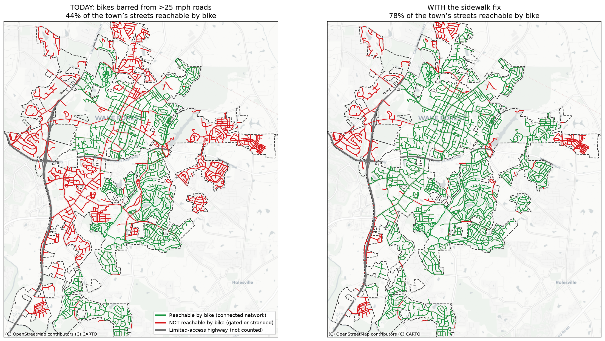

# Wake Forest micromobility reachability map

A map and analysis of where you can legally ride a bike or e-scooter in Wake
Forest, North Carolina, given the town's Chapter 30 rules.

Chapter 30 bars micromobility from sidewalks and from any road posted over
25 mph. This project builds the town's actual street, greenway, sidewalk, and
bike-lane network from open data, applies those rules, and computes which parts
of town form one connected, legally rideable network and which are stranded
behind fast roads. It also models a one-sentence rule change, allowing bikes on
the sidewalks of roads over 25 mph where there is no bike lane, and measures how
much of the network that reconnects.



## The finding

- Under the rules as written, about **44 percent** of the town's streets are
  reachable by bike as one connected network.
- Allowing bikes on the sidewalks of roads over 25 mph (where there is no bike
  lane) raises that to about **78 percent**.
- Reachability is computed as the largest connected component a rider can travel
  without using a barred road or sidewalk. Stranded "islands" are street segments
  that are rideable in isolation but cut off from the main network by fast roads.

All numbers are modeled estimates from the data and assumptions described below.

## What's in here

- `wake-forest-micromobility-map.html`: an interactive map. Open it in a browser.
- `figures/`: the rendered figures (the town before/after panels).
- `map/`: the analysis pipeline (Python) plus its precomputed GeoJSON and CSV
  outputs.
- `DATA_LICENSE.md`: per-source data licenses and attribution.
- `requirements.txt`: pinned Python dependencies.

## Reproduce

Requires Python 3.11 or newer.

```
python -m venv .venv && source .venv/bin/activate
pip install -r requirements.txt
```

Key entry points, run from inside `map/`:

- `build_islands.py` builds the street and path graph from OpenStreetMap and
  computes the reachability network, the minimal sidewalk sets that would
  legalize the stranded islands, and the sign placements.
- `build_map.py` renders the interactive map to
  `../wake-forest-micromobility-map.html`.
- `fig_variant.py` regenerates the figures into `../figures/`.
- `fetch_osm.py` and `fetch_ncdot.py` re-download the source OpenStreetMap and
  NCDOT data. Please be gentle with the servers.

The committed `*.geojson` and `*.csv` in `map/` are the precomputed results, so
the figures and the interactive map can be rebuilt without re-fetching.

## Data and license

Road, sidewalk, and bike-lane geometry comes from OpenStreetMap. Greenways and
multi-use paths come from the Town of Wake Forest's open GIS. Posted speeds come
from NCDOT. See [DATA_LICENSE.md](DATA_LICENSE.md) for the per-source terms and
attribution. OpenStreetMap-derived data is under the ODbL (share-alike).

The **code** in this repository (the Python scripts) is released under the
**MIT License** — see [LICENSE](LICENSE). MIT covers the code only; the
committed data keeps the terms above (the OpenStreetMap-derived GeoJSON remains
ODbL, share-alike).

This is a non-commercial civic project. The analysis is my own and is not an
official product of the Town of Wake Forest. All figures are modeled estimates
from the data above. See the code for assumptions and caveats.
